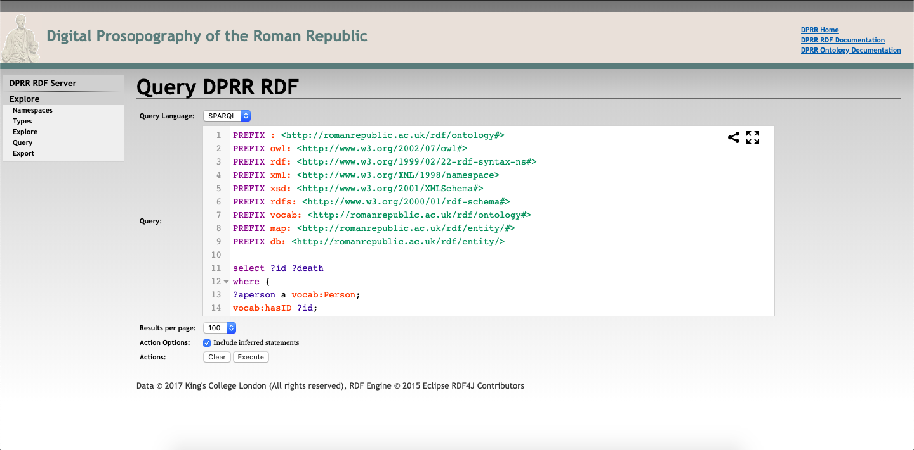

# Introduction
The Shape of Roman History project explores the history of Roman Republic through an analysis of the most up-to-date database of ancient persons available [http://romanrepublic.ac.uk/](http://romanrepublic.ac.uk/). Through the existing rdf database, we were able to make new connections and gain a deeper insight into Roman life. The data visualizations in this project were created with D3. Google Charts, and Unity3D. This project is affiliated with UCLA RomeLab [http://hvwc.etc.ucla.edu/](http://hvwc.etc.ucla.edu/).

# DPRR RDF Repository - Query

Using the Digital Prosopography of the Roman Republic's RDF Repository, the queries were manually inputted and returned with the specific data. Here is an example of a query used to find all the documented Romans with the title of Triumphator:  

# Visualizations
<iframe src="https://gist.githubusercontent.com/cjohanson/ecb15d409bb5dfee744890ce582dedc3/raw/8510c13a90fec0b41d0cf3ca07909b4833484f21/index.html"></iframe>

## The Roman Funeral
The Roman Funeral offered families an opportunity to highlight the achievements of their deceased ancestors.  Many funerals culminated in a speech on the Rostra, the primary speaking platform in the Forum, with actors hired to wear garments associated with the highest political position each ancestor in the family obtained.

An <i>in situ</i> representation of funerals for all men in the database, with three levels of certainty.  
  <a href="http://hvwc.etc.ucla.edu/funerals-rostra">Funerals on the Rostra</a>
  
An interactive 3D "bar graph" of funerals per 25 year period.  
    <a href="http://hvwc.etc.ucla.edu/funeral-visualizations-version-2">Funerals as a Bar Graph</a>
## General Statistics
The number of Roman women born in each 25 year period.  
  <a href="https://bl.ocks.org/kaylynnguyen/raw/566e35c13c009858e871baa69dca879b/">Roman women born per 25 Years</a>
  
The number of adopted sons born in each 25 year period.  
  <a href="https://bl.ocks.org/kaylynnguyen/raw/6cd35d60315b14a47386e9a26de06226/">Adopted Sons per 25 Years</a>
  
The number of Roman men with at least 2 wives per 50 years.  
  <a href="http://bl.ocks.org/kaylynnguyen/raw/3ca3a210ad84b5c90e68868c933a1eb0/">Roman Men with at least 2 Wives</a>
  
The number of violent deaths that occurred in Roman history per 50 years.  
  <a href="http://bl.ocks.org/kaylynnguyen/1e2bfda60c542fcafca3610f2433d295">Violent Deaths per 50 Years</a>
  
The family connections of P. Valerius Poplicola, including children, spouse, and adoptions.  
  <a href="http://bl.ocks.org/theordorang/b058176be59b37bb8fb46c38d5af572f">Family of P. Valerius Poplicola</a>
  
The lifespan of Romans according to the database (large numbers represent uncertainty).  
  <a href="http://bl.ocks.org/bniedzie/44bafb802510425db3bf57566da4d952">Lifespan of Romans</a>
  
Percentage of Birth/Death Dates Listed as Uncertain per 50 Years.  
  <a href="https://bl.ocks.org/bniedzie/2af7c1c2d24e755e4190b94ab52d0a44">Uncertainty in Birth/Death Dates by Year</a>

## Visualizations by Political Office
Many political offices existed in Rome.  Some, like consul, were held by the same number of people per year (2), while others, like dictator, were appointed in times of crisis only.  These visualizations can be used to, among other things, show gaps in the database.
### Triumphators
The number of Romans that held the office title of Triumphator every 25 years. 
  <a href="http://bl.ocks.org/diannepeng/raw/7e404a8bffd613757ec835139406daf5/">Triumphators per 25 Years</a>  
The highest office obtained by distinguished Triumphators.  
  <a href="https://bl.ocks.org/Kyle-Fernando/raw/e7459ea6b9c03a26d5483afc6bbbde00/">Highest Office of Triumphators</a>  
### Censors
The number of Censors that died in each 25 year period.  
  <a href="http://bl.ocks.org/kaylynnguyen/raw/5f2373122ff2e83c88a11f46ed6e8ea8/">Censors that died per 25 Years</a>  
### Senators
The number of Romans who became Senators per 25 Years.  
  <a href="http://bl.ocks.org/kaylynnguyen/raw/d4c940fd0d0529f17966f9bec1a0f186/">Roman Senators per 25 Years</a>
  
The maximum length of Senator office terms over time.  
  <a href="https://bl.ocks.org/nancypaucar/raw/978cb5ca53b0222de43199fe20635cbe/">Senator Office Terms</a>
### Consuls
The number of Romans that held the office title of Consuls every 25 years.  
  <a href="http://bl.ocks.org/kaylynnguyen/raw/b33f68bcc30039671f00193448db4365/">Roman Consuls per 25 Years</a>
  
The number of Consuls with a wife, who is the daughter of another Consul per 25 years. This shows how closely intertwined the upper positions of political offices were.  
  <a href="http://bl.ocks.org/kaylynnguyen/raw/dfde49abd5e671da9dd88605ad63ce04/">Consuls whose wife is daughter of another Consul</a>
  
The number of Consuls with a daughter married to another Consul per 25 years. This visualization is related to the previous one.  
  <a href="http://bl.ocks.org/kaylynnguyen/raw/2714ea2262cd3ad167a17cb402375081/">Consuls with daughter married to another Consul</a>
  
Family Lines with Consuls who married someone whose father held a higher office.  
  <a href="https://bl.ocks.org/nancypaucar/raw/6128873c854658031b3880e54d090712/">Consul families who married into a higher status<a/>
  
The number of Consuls per family line.  
  <a href="https://bl.ocks.org/nancypaucar/raw/63de120a94b9c034f64e1fe514a8969c/">Counsuls per Family Line</a>
  
The number of Consul by their Nomen.  
  <a href="https://bl.ocks.org/kaylynnguyen/raw/14cfa6d0be7c7ded74167d01057ae07d/">Consul by Nomen</a>

The most popular first names of Consuls.  
  <a href="https://bl.ocks.org/Kyle-Fernando/raw/8a52af38f894c0d68ff4e64dfd2ec6aa/">Popular Consul First Names</a>

## Network Visualizations
Linked below are network visulizations of specific Romans in the database. The networks show their familial connections.  
  <a href="https://bl.ocks.org/theordorang">Family Network Visualizations</a>

# Project Contributors 

Chris Johanson   
Benjamin Niedzielski  
  <a href="https://bl.ocks.org/bniedzie">Benjamin Niedzielski's Visualizations</a>  
Kaylyn Nguyen  
  <a href="https://bl.ocks.org/kaylynnguyen">Kaylyn Nguyen's Visualizations</a>  
Dianne Peng  
  <a href="https://bl.ocks.org/diannepeng">Dianne Peng's Visuazliations</a>  
Jarett Horton  
Kyle Fernando  
  <a href="https://bl.ocks.org/kyle-fernando">Kyle Fernando's Visualizations</a>  
Leslie Aguilar   
  <a href="https://docs.google.com/spreadsheets/d/1JAs6rxk-iI4lG4Xqhm2TWUV0AGkoaxdPRyP3QyzcfrU/edit#gid=1547715230">Leslie Aguilar's Visualizations</a>  
Nancy Paucer   
  <a href="https://bl.ocks.org/nancypaucar">Nancy Paucer's Visualizations</a>  
Natasha Ann  
  <a href="https://bl.ocks.org/natashaannn">Natasha's Ann Visualizations</a>  
Olivia Kope  
Theodora Ng  
  <a href="https://bl.ocks.org/theordorang">Theodora Ng's Visulizations</a>  

